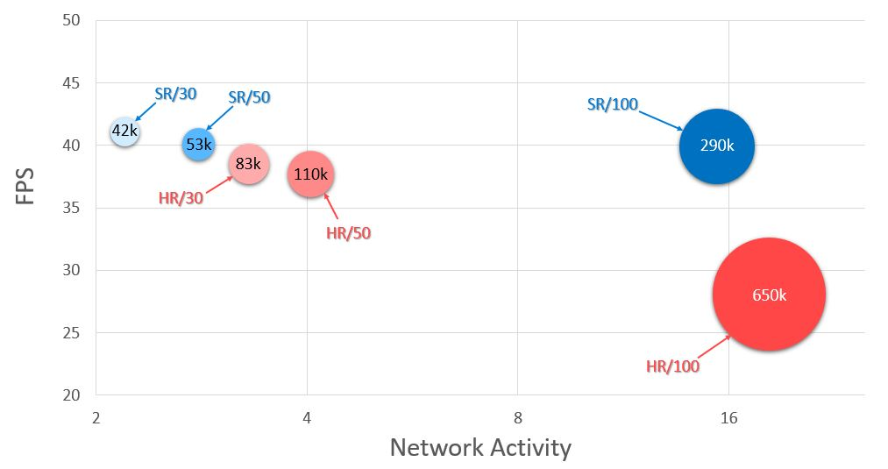
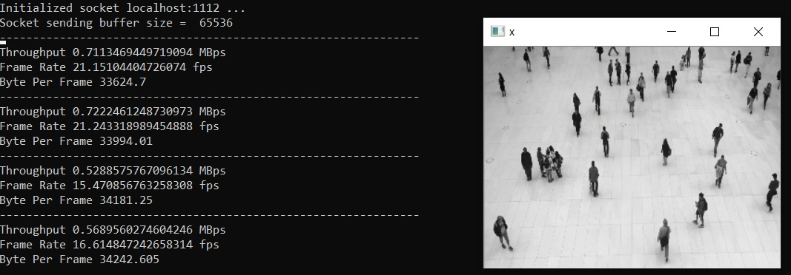
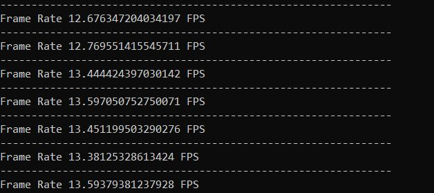
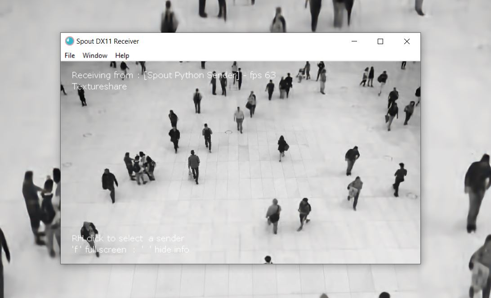

# StreamingSR

The second prototype of an AI for video streaming. On the sender, the center of the high resolution image/frame is cropped, and then the high resolution image is downscaled with the factor of 4. After that, the cropped image and the downscale image go through existing image compression (in this case JPG compression) before they are sent. On the receiver, data is decoded. The downscaled image is upscaled using image super resolution neural network. Finally, the output combines with the cropped image.


## Results

<div align="center">

<p>Example 1 from newyork.mp4 </p>
</div>

<div align="center">

<p>Example 2 from people.mp4 </p>
</div>

## Tested System

The program have been tested on two systems. The first one was with:
* Window 10 operating system
* Intel(R) Core(TM) i7-8750H CPU
* NVIDIA GForce GTX 1050 GPU

The second one was with:
* Window 10 operating system
* Intel(R) Core(TM) i5-8500 CPU
* NVIDIA GForce RTX 2080 SUPER

## Performance

<div align="center">

<p>Performance of the method with super resolution comparing with that of the method without super resolution </p>
</div>


Note that XX/YY represents using method XX with jpg compression quality YY, and the experiment was performed on the second tested system 
* vertical axis : frame rate (fps)
* horizontal axis : network activity (GBps) 
* size : size of data (KB)

## Prerequisite

### Applications & Programs

* [Python 3.6.5](https://www.python.org/downloads/release/python-365/)
* [Spout 2.006](https://spout.zeal.co/)
* [Visual Studio](https://visualstudio.microsoft.com/downloads/)
* [Boost](https://www.boost.org/)
* [Spout-for-Python library](https://github.com/spiraltechnica/Spout-for-Python)

### Python Modules

These modules are mandatory:


* PyTorch (tests with version 1.5.0+cu92)
* TorchVision (tests with version 0.6.1+cu92)
* OpenCV (tests with version 4.0.1.24)
* Numpy (tests with version 1.18.2)
* PyGame (tests with version 1.9.6)
* OpenGL (tests with version 3.1.0)
* Pillow (tests with version 5.3.0)
* H5py (tests with version 2.9.0)
* Argparse (tests with version 1.1)
* Tqdm (tests with version 4.31.1)


To install, use this command.

```bash
pip install torch==1.5.0+cu92 torchvision==0.6.0+cu92 -f https://download.pytorch.org/whl/torch_stable.html
pip install opencv-python==4.0.1.24 numpy==1.18.2 pygame==1.9.6 pyopengl==3.1.0 pillow==5.3.0 h5py==2.9.0 argparse==1.1 tqdm==4.31.1
```


## Training

The super resolution neural network was modified from [CARN](https://github.com/nmhkahn/CARN-pytorch).

### Preparing The Training Data

Download the [DIV2K](https://data.vision.ee.ethz.ch/cvl/DIV2K/) dataset and run the following command to convert the training dataset to hierarchical data format (hdf5, .h5)

```bash
cd dataset
python generateH5.py --dataset_folder your_dataset_folder --hdf5_name hdf5_name --num_per_group data_amount_per_group
```

Or download the training data stored in a hierarchical data format (hdf5, .h5) from [google drive](https://drive.google.com/file/d/1UwCPo3V6x80sELU9VPk-aiS_Eq3e4CG4/view?usp=sharing)

### Training The Model

To train the model, go to the project directory if you are in dataset directory, and then run the following command:

```bash
python train.py
```
Note that, you can specify following input arguements:
* --ckpt_name : path and name of the checkpoint to be loaded (default 'checkpoint/checkpoint.pth')
* --saved_ckpt_dir : directory that the new checkpoint will be saved to (default 'checkpoint/new')
* --train_data_path : directory of the dataset in hdf5 format (default "dataset/DIV2K_train.h5")
* --batch_size : batch size (default 1)
* --update_every : number of batch to update the network weights (default 1)
* --patch_size : size of training images (default 64)
* --lr : learning rate (default 0.001)
* --decay : decay rate of the learning rate (default 400000, halved every 400000 epoch)


## Streaming

### Build SpoutSDK

If you use python with different version, you have to build new spoutSDK. Please follow [this tutorial](https://rusin.work/vjing/tools/spout-for-python/?fbclid=IwAR2-7DcQUpr4SqxAqM5LkWbYCu3RPgEMsNQ5MuAbW6JwzyHCYtoqrOqoEfQ). After complete this, you will get a file name "SpoutSDK.pyd" and you shall replace the file given in the project with the new one.

### Sender

Download the testing videos from [google drive](https://drive.google.com/drive/folders/1l9kyQgK2v6XYmUR_JJ2SMgLETVyRN-VD?usp=sharing) or [free videos](https://www.pexels.com/videos/) , and run this command:

```bash
python send.py --host ip --method method --video path_to_your_video --nthread number_of_streaming_thread --jpg_quality compression_quality
```

Note that, you can specify following input arguements:
* --method : method to be used, either with 'sr' (with superresolution) or 'hr' (without superresolution, send high-resolution iamge instead) (default 'sr')
* --host : ip (default 'localhost')
* --port : port (default "1112")
* --image_width : image width (default 1280)
* --image_height : image height (default 960)
* --scale : downscaling factor (default 4)
* --nthread : number of thread in video streaming (default 8)
* --jpg_quality : quality of jpg compression 1-100 (default 50)
* --use_saved_video : use saved video or webcam, 'True'/'1'/'T' for saved video and 'False'/'0'/'F' for video from webcam (default True)
* --video : path to saved video (default './dataset/Video/people.mp4')
* --video_maxframe : length of saved video (default 100 frames)
* --max_sender_fps : maximum speed (frame per second) of the sender (default 1/24)
* --max_video_fps : video updating/reading speed (default 1/24)
* --sock_buff_size : buffer size (default 20480)

After runny sender.py, a video will pop up and command line will displays three figures every 100 frames:
* Throughput : the average amount of data (mega bytes) that is send in one second (Mega Bytes Per Second; MBps)
* Frame Rate (Frame Per Second; FPS)
* Size : Size of an image/a frame (Kilo Bytes; KB)

<div align="center">

<p> Result after running sender.py </p>
</div>


### Receiver

After the sender is started, run this command:

```bash
python receiver.py --host ip --method method --nthread number_of_streaming_thread
```

Note that, you can specify following input arguements:
* --method : method to be used, either with 'sr' (with superresolution) or 'hr' (without superresolution, send high-resolution iamge instead) (default 'sr')
* --host : ip (default '127.0.0.1')
* --port : port (default "1112")
* --image_width : image width (default 1280)
* --image_height : image height (default 960)
* --scale : downscaling factor (default 4)
* --nthread : number of thread in video streaming (default 8)
* --max_receiver_fps : maximum speed (frame per second) of the receiver (default 1/24)
* --half_precision : use model with half precision or not, 'True'/'1'/'T' or 'False'/'0'/'F' (default True)
* --save_video : save the output as video or not, 'True'/'1'/'T' or 'False'/'0'/'F' (default False)
* --video_name : name of the saved video (default 'output.avi')
* --save_nframe : length of the saved video in the unit of frames (default 100)

After runny receiver.py, a video will pop up and command line will displays the average frame per second every 100 frames

<div align="center">

<p> Result after running receiver.py </p>
</div>

To perfrom a priliminaty test, you can view the output from spout. First, go to the directory the you have installed "Spout2" or click "Spout 2.006" locating on the desktop. Then go to "DEMO" and run "SpoutReceiver". Finally, select the spout sender by go to "File" and "Select Sender", and the output video will display on Spout. 

 <div align="center">

<p> Result after running Spout as receiver </p>
</div>

## Issue
If there is a problem, please create a new issue or email me.

## License
[MIT](https://choosealicense.com/licenses/mit/)